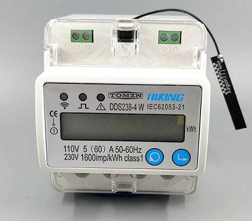

# SmartMeter238

Library for reading DDS238-4 W Wifi Smart meter (SM) and maybe DTS238-7 W (I need people with this meter for test). This library uses serial communication, you have to flash the ESP8266 that this meter has.



## Usage
```c++
#include "SmartMeter238.h"

// Config DDS2384W
SmartMeter238 sm(Serial);                                        

// Data storage
SmartMeter238::smartMeterData smData;
```
---
```c++
// initialize SmartMeter238 communication
sm.begin();
```
---
```c++
// Update data storage
sm.getPowerCutData(&smData, true);
sm.getMeasurementData(&smData, true);
sm.getLimitAndPurchaseData(&smData, true);
sm.getPowerCompanyData(&smData, true);

// Print data storage
Serial1.println(smData.measurementData.time);
Serial1.println(smData.measurementData.data.current);
Serial1.println(smData.measurementData.data.voltage);
Serial1.println(smData.measurementData.data.frequency);
Serial1.println(smData.measurementData.data.reactivePower);
Serial1.println(smData.measurementData.data.activePower);
Serial1.println(smData.measurementData.data.powerFactor);
Serial1.println(smData.measurementData.data.lapseOfTimeTotalEnergy);
Serial1.println(smData.measurementData.data.lapseOfTimeImportEnergy);
Serial1.println(smData.measurementData.data.lapseOfTimeExportEnergy);
Serial1.println(smData.measurementData.data.lapseOfTimePriceEnergy);
Serial1.println(smData.measurementData.data.totalKWh);

Serial1.println(smData.powerCompanyData.time);
Serial1.println(smData.powerCompanyData.data.startingKWh);
Serial1.println(smData.powerCompanyData.data.priceKWh);

Serial1.println(smData.limitAndPurchaseData.time);
Serial1.println(smData.limitAndPurchaseData.data.energyPurchase);
Serial1.println(smData.limitAndPurchaseData.data.energyPurchaseBalance);
Serial1.println(smData.limitAndPurchaseData.data.energyPurchaseAlarm);
Serial1.println(smData.limitAndPurchaseData.data.energyPurchaseStatus);
Serial1.println(smData.limitAndPurchaseData.data.maxCurrentLimit);
Serial1.println(smData.limitAndPurchaseData.data.maxVoltageLimit);
Serial1.println(smData.limitAndPurchaseData.data.minVoltageLimit);

Serial1.println(smData.powerCutData.time);
Serial1.println(smData.powerCutData.data.powerCut);
Serial1.println(smData.powerCutData.data.powerCutDetails);
Serial1.println(smData.powerCutData.data.delay);
Serial1.println(smData.powerCutData.data.delaySetPowerCut);
```
## Other
```c++
sm.setLimitsData(50, 270, 175, &smData);
sm.setPurchaseData(9999.99, 999.99, SM_SET_ON, &smData);
sm.setPowerCutData(SM_SET_ON, &smData);
sm.setDelay(SM_SET_ON, 99, &smData);
sm.setReset(&smData);
sm.setPowerCompanyData(99999.99, 999.99, &smData);
```
## Compatible Hardware

The library uses ESP8266 Core for interacting with the underlying network hardware. This means it Just Works with a growing number of boards and shields, including:

 - ESP8266

## Note
This documentation is at work.

## License

This code is released under the MIT License.
